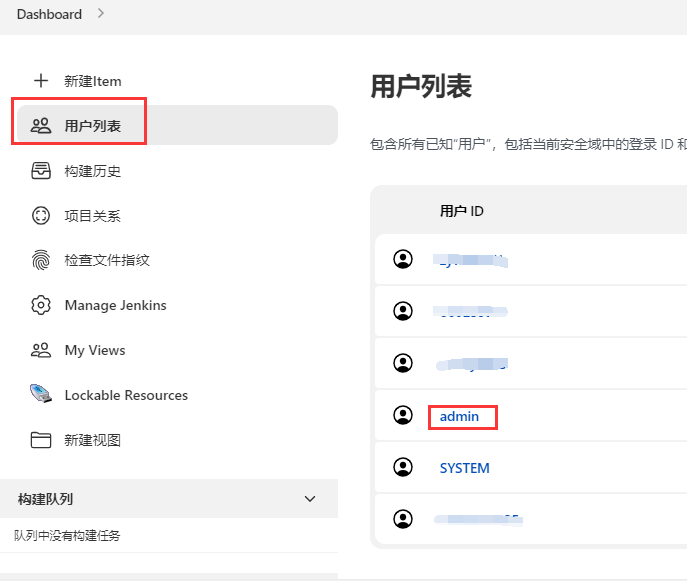
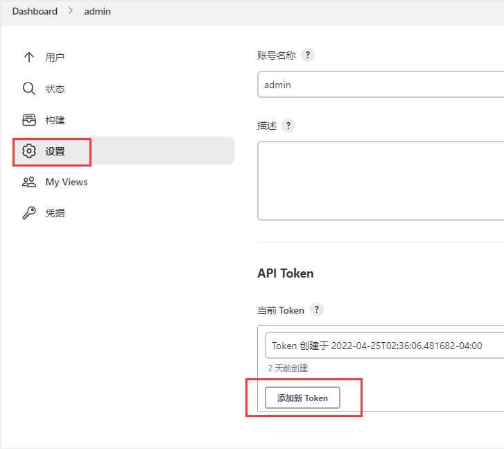
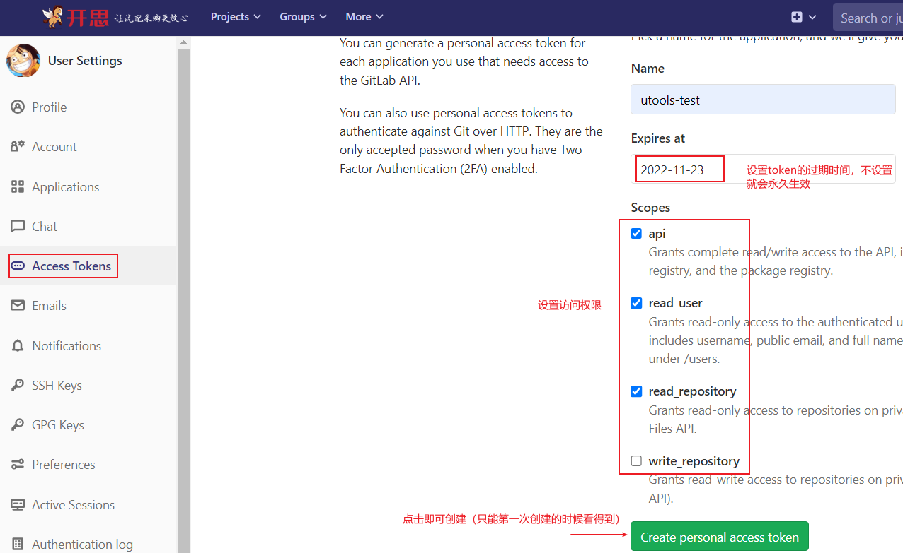

# cass-jenkins
功能简介：在 [utools](https://www.u.tools/) 中进行 [jenkins](https://www.jenkins.io/zh/) 任务的`CICD`
项目出发点：原生 `Jenkins` 的页面操作起来太不方便了，忍无可忍~~~


## 功能简介
- [x] `Jenkins` 相关支持
  - [x] 支持 `Jenkins` 登录（`Token`方式）
  - [x] 支持 `Jenkins` 获取 `views`
  - [x] 支持 `Jenkins` 获取某个`view`下的 `jobs`
  - [x] 支持获取 `FreeStyleProject` 基本信息
  - [x] 支持获取 `WorkflowMutiBranchProject` 基本信息
  - [x] **支持 `FreeStyleProject` 的构建、取消、获取日志（最近一次）**
  - [x] **支持 `WorkflowJob` 的构建、取消、日志（最近一次）**
  - [ ] 支持获取 xxxxxx （developing......）
- [ ] `GitLab` 相关支持
  - [x] 支持 `GitLab` 登录（`Token`方式）
  - [x] 支持获取 `Git` 项目列表
  - [ ] **支持 `Jenkins CI` 时直接选择代码分支**
- [ ] `Docker` 镜像相关支持
  - [ ] **支持`Jenkins CD`时直接选择 `Docker` 镜像**


## 鸣谢
本项目地址：[https://github.com/small-universe/utools-jenkins](https://github.com/small-universe/utools-jenkins)

参考的项目：
1. [https://github.com/zyw/utools-jenkins](https://github.com/zyw/utools-jenkins) 👈本项目从这个仓库拉的分支
2. [https://github.com/J2ephyr/utools-jenkins](https://github.com/J2ephyr/utools-jenkins) 👈第一个个项目参考的这个
3. [https://github.com/me10zyl/utools-jenkins](https://github.com/me10zyl/utools-jenkins) 👈第二个项目又是参考的另外这个哈

> 天下文章一大抄 ~~~


## 运行项目
若要完整运行，需要依赖于 [utools](https://www.u.tools/) 开发模式

#### 1. 安装依赖
```
npm install
```

#### 2. 项目启动（支持热加载）
```
npm run serve
```

#### 3. 打包部署
```
npm run build
```

## 项目开发
> 依赖于 [utools](https://www.u.tools/)，电脑上先要安装这个插件
> 开发文档：[插件开发](https://www.u.tools/docs/developer/welcome.html#plugin-json)

待补充~~~

## 使用方式

### Jenkins Token获取
#### 1. 第一步


#### 2. 第二步


### GitLab Token获取

#### 1. 第一步


#### 2. 第二步
